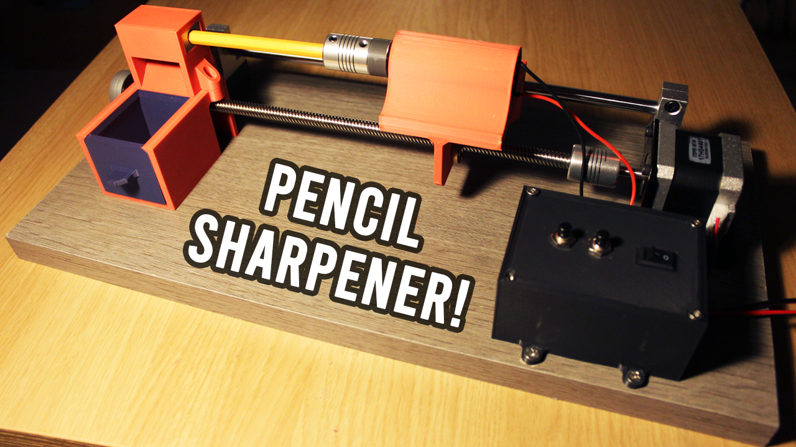
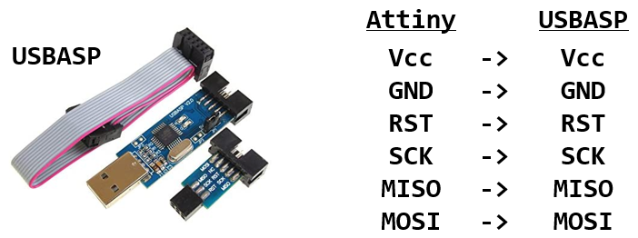
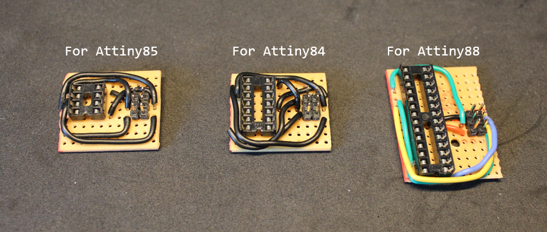

# Automatic pencil sharpener

An automatic pencil sharpener machine that works using linear motion. You can sharpen any pencil just by pressing a button and it will take care of the rest, including gathernig up all the rubbish into a container.

There is a [video](https://youtu.be/7P9160cqDPM) associated with this repository/project, I highly recommend watching it before using this repo.

# Arduino

You can find the Arduino sketch in the `auto_pencil_sharpener` directory.

## How to upload code to Attiny MCs if needed

- The Attiny MCs can be programmed just like any Arduino and it's very easy to upload code to them.
- You just need a USBASP adapter, then simply make the connections as shown in the image below.

- You will also need to install the Attiny boards using the [AttinyCore](https://github.com/SpenceKonde/ATTinyCore) board manager by placing this link `http://drazzy.com/package_drazzy.com_index.json` to your "Additional Boards Manager URLs", which can be accessed in `File > Preferences`.

- From `Tools > Board`, choose your Attiny board with the no bootloader option.
- Then go to `Tools > Programmer` and choose `USBasp (ATTinyCore)`, and then press `Tools > Burn Bootloader`.
- Then to simply upload code, use `Sketch > Upload Using Programmer`.

- You can use stripboards with some wires to make uploading code to the Attiny MCs more convenient:

# Components

- `Attiny84`, for the micro-controller.
- `Nema 17` stepper motor, for the linear motion.
- `A4988` stepper motor driver, with 100µF-1000µF capacitor across the motor power pins.
- `12V` power supply, with at least 3A max rated current.
- `LM2596` DC-DC step up/down converter, to convert 12V to 5V. 12V is required for the motors, 5V for the micro-controller.
- `MCP1700`, 5V voltage regulator, to ensure the Attiny84 has a consistent and smooth voltage. 1000/100µF and 100,000pF capacitors are soldered directly on the MCP1700 to deal with voltage spikes.
- `12V DC motor`, the one used has a max speed of 500 RPM.
- `IRF3708 MOSFET`, to be able to control the DC motor using a micro-controller.
- `1N4004 Diode`, to be placed across the DC motor to prevent negative voltage spikes if the DC motor is rotated when the circuit is off.
- `Sliding switch`, as an on and off switch.
- `2 buttons`, to control the stepper motor, left and right controls.

Optional:
- `Potentiometer`, this will be used to fine-tune the speed of the stepper motor, so it does not move too fast towards the sharpener.

# Wiring

## Breadboard

Coming soon.

## Stripboard

Coming soon.

# 3D printing

Please refer to the `/3d_printing` directory.